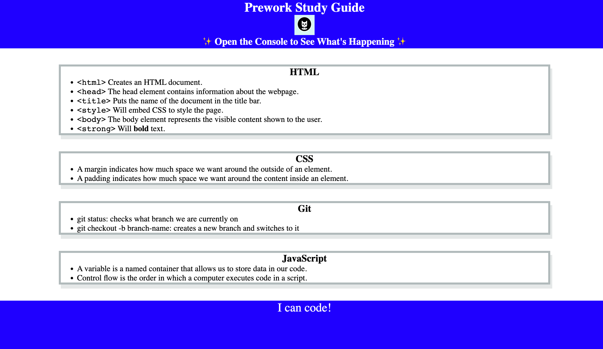

# Prework Study Guide Webpage

## Description

This Prework Study Guide was created for boot camp students who were going through the Prework. It contains notes on HTML, CSS, Git, and JavaScript.

## Technology Stack

## Usage

To use this Prework Study Guide, you can review the notes in each section. For suggestions on what to study first, open the Chrome DevTools by pressing Command+Option+I (macOS) or Control+Shift+I (Windows). A console panel should open either below or to the side of the webpage in the browser. There you will see a list of topics we learned from the prework along with a suggestion on which topic to study first.

## Screenshot

## Deployed page

[View Published Page](https://erin-m-keller.github.io/prework-study-guide/)

## License

[MIT](https://choosealicense.com/licenses/mit/)